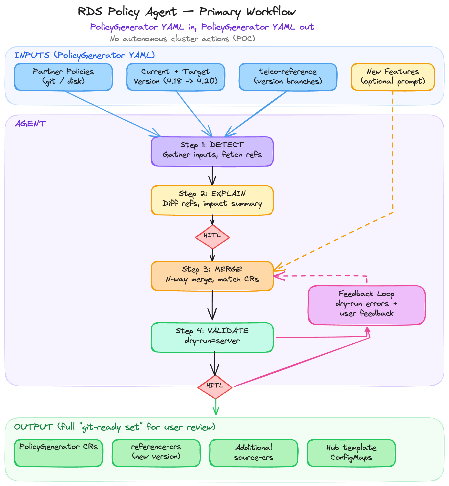

# RDS Policy Agent — AI-Driven Policy Generation for Version Updates

> This document covers the problem statement and core workflow. Architecture, merge engine design, and operational details (error handling, rollback, security, observability) are covered in follow-up documents.

## 1. Context

Telco partners deploy OpenShift clusters with Day 2 configs based on a Reference Design Specification (RDS).
The upstream version of these reference configs live in [telco-reference](https://github.com/openshift-kni/telco-reference).
Users customize per environment (e.g., number of SRIOV VFs, NIC assignments, CPU pinning) and per site (IPs, VLANs, hostnames) via patches and hub templating. They will also extend the configuration with additional custom content based on their environment and requirements.
The resulting customized policies are applied to clusters through ACM.
This Proof-Of-Concept targets the RAN DU SNO profile (`telco-ran/` in telco-reference). The agent doesn't hardcode RAN DU SNO assumptions or knowledge — it works with whatever configuration (configuration CRs, Policy, or PolicyGenerator) structure it finds.

### Problem

When a partner is ready to move their solution to a new OCP version, they must build a set of policies which incorporate content from 3 distinct places:
1. The new RDS reference content (from telco-reference or ztp-site-generator)
2. Their specific modifications made in the current set of policies on top of the previous RDS version
3. Optionally, additional "new" content/features to be added to the policy set

This means merging reference changes with their existing customizations — a manual process that requires understanding what changed, why, and how it interacts with site-specific overrides. Today this is slow, error-prone, and requires deep RDS + operator knowledge.

### Goal

Significantly shorten the time and effort it takes a user to get from "I have a valid set of policies for 4.18" to "I have a valid set of policies for 4.20".

The overall goal is **policy generation for version updates**: a partner running 4.18 needs to update to 4.20 — give them the final set of policies. The inputs are:
1. Previous and new RDS reference content (e.g. 4.18 → 4.20)
2. Partner customizations on top of the previous RDS version
3. Optionally, additional "new" content/features to be added to the policy set

### Scope

Generation of a new set of Policies which are correct for the new release version and desired set of changes from the user. In this PoC the agent generates the matching Day 2 config policies for human review and approval — it doesn't perform the platform upgrade itself. The cluster is assumed to already be at the target OCP version.

The agent is responsible for generating content and making it available for human review, thus conforming to Human In The Loop (HITL) principles. The agent does not make modifications to clusters.

Starting from an existing deployment of clusters managed by an ACM hub cluster. The hub has policies which define the desired configuration state for the clusters at the current (e.g. 4.18) release. The agent provides the following capabilities:
- Assists the user by creating a complete set of policies for the next release (e.g. 4.20) through merging new RDS reference content and existing customizations from the existing deployment
- Validates the correctness of the policies (dry-run apply to a hub in POC, compliance checking in Phase 2)
- Accepts partner-described hardware changes as part of "new content/features" input (e.g. a new entry in a template lookup like `hwtype=x has cpuset=2-63,66-127`)
- Identifies new template values added to reference which need to be defined for existing clusters or deployments (depending on scope of the template variable).

POC targets the full RAN DU SNO PolicyGenerator set:
- [acm-common-ranGen.yaml](https://github.com/openshift-kni/telco-reference/blob/main/telco-ran/configuration/argocd/example/acmpolicygenerator/acm-common-ranGen.yaml) (common — waves 1-2)
- [acm-group-du-sno-ranGen-templated.yaml](https://github.com/openshift-kni/telco-reference/blob/main/telco-ran/configuration/argocd/example/acmpolicygenerator/hub-side-templating/acm-group-du-sno-ranGen-templated.yaml) (group — wave 10)
- [acm-example-sno-site.yaml](https://github.com/openshift-kni/telco-reference/blob/main/telco-ran/configuration/argocd/example/acmpolicygenerator/acm-example-sno-site.yaml) (site — wave 100)

### Out of Scope (POC)

See section 5 for details.
- Stale workaround detection and removal (stretch goal for PoC)
- Fleet rollout orchestration
- Cluster upgrade orchestration (platform upgrades, IBU seed images — agent handles Day 2 config policies only)
- Agent-inferred hardware changes — agent attempts to infer updates needed based on a new hardware platform from inspection of a cluster, hardware spec sheets, bill-of-materials, etc.
- Fresh installs
- Writing to the cluster — the agent does not persist any resources to etcd in POC. Dry-run validation (`--dry-run=server`) is read-only server-side validation. Actual policy application (writing to etcd) requires human action outside the agent.
- Dynamic live cluster/fleet state updates — the agent does static generation of policies to govern the desired state of a fleet of clusters after moving to a new version; it does not react to or update policies based on dynamic live cluster state

---

## 2. Assumptions and Requirements

1. **PolicyGenerator format** (not older PolicyGenTemplate) is used
2. **RAN DU SNO profile** for POC (as stated in section 1)
3. **Reference access** — the agent has access to all RDS reference versions. For POC this is through the telco-reference repo (version branches). Agent assumes branch content is valid; branch validation is not in scope.
4. **Hub cluster access** — the agent may have read-only access to a hub cluster for extended verification
5. **Git access** — the agent has read access to the policy git repository. The agent can post a pull request (create a branch and the PR) only if that access/permission is explicitly granted by the user
6. **PolicyGenerator binary** — available to the agent for reference analysis in EXPLAIN. The PolicyGenerator utility is not closely tied to OpenShift versions. For the PoC the latest PolicyGenerator version will be used regardless of initial or target policy release. Production versions should consider alignment.

---

## 3. How RDS Configs Work

Key points:

- **Reference CRs** are base CRs with expectation that there will be user variations in some fields. PolicyGenerator pulls these CRs into policies and allows patching with kustomize-like overlays.
- **PolicyGenerator YAML** defines policies: manifest references, patches (hardcoded or hub templates), placement, remediation. This is where user customizations live — explicit as `patches:`.
- **Hub templates** (`{{hub fromConfigMap ... hub}}`) in patches are resolved at policy evaluation time from ConfigMaps, Secrets, etc on the hub. Users provide per-cluster content in these ConfigMaps to ensure overall consistency across the fleet even when sites may have unique values for some configuration.
- The merge must handle both template systems: preserve user's hardcoded overrides of hub templates, and update reference structural changes.

**Reference source:** [openshift-kni/telco-reference](https://github.com/openshift-kni/telco-reference) with version branches (`release-4.17`, `release-4.18`, etc.). Each branch has verified reference CRs + PolicyGenerator configs for that OCP version. [quay.io/openshift-kni/ztp-site-generator is the production source for these CRs — the agent's reference source should be pluggable. POC uses the Git repo for convenience; production should use the released container manifests.]

**Input source:** The agent reads partner policies as PolicyGenerator YAML from disk or git.

The agent may work with policies that are managed via gitops, but it does not depend on ArgoCD infrastructure for its own operation.

---

## 4. Primary Workflow

The agent works at the **PolicyGenerator** level — this is the layer the user maintains and interacts with. PolicyGenerator YAML is both the input and output format.



The **agent** is an AI model with access to tools (K8s API, Git, PolicyGenerator, merge engine) that reasons about the problem, decides which tools to call, and executes multi-step workflows.

### Agent Capabilities

The agent provides three distinct capabilities that are independently valuable and composed into the end-to-end update flow:

1. **EXPLAIN** — Analyze the diff between RDS reference versions and produce a structured impact summary with per-CR detail. Useful standalone for planning, independent of merging. Also useful to the agent itself for determining merge behavior — the structured output informs which CRs need matching and what kind of changes to expect.
2. **MERGE** — N-way merge: a series of ordered, incremental 2-way merges. Start with existing partner policies → merge reference updates → merge new functionality requested by the partner → etc. Each step is incremental. Matches CRs by GVK + resource identity with confidence-based matching (exact/fuzzy/none). Reuses EXPLAIN output to scope the merge. Useful standalone for generating merged configs without the full validation flow.
3. **VALIDATE** — Verify the generated artifacts for correctness so that they can be successfully applied to a hub cluster. In POC this includes: syntax validation based on Policy CRD, feedback from apiServer in dry-run (read-only) apply, and feedback from user on correctness via additional prompting.

The end-to-end update workflow (DETECT → EXPLAIN → MERGE → VALIDATE → COMPLIANT) composes all three: EXPLAIN informs MERGE, and VALIDATE is invoked to drive policies to compliance.

The agent uses its tools as needed — some steps are straightforward tool usage (fetch reference branches, run PolicyGenerator to diff reference versions, read Policy CRs from hub), others require reasoning about the results (interpret a diff, resolve a conflict, diagnose a failure). For POC, we minimize the reasoning needed by treating all user changes as intentional customizations (no classification) and escalating all true conflicts to the user.

### End-to-End Update Flow

From the user's perspective, the end-to-end flow is:

1. I provide my existing policies (from disk or git)
2. I say what version I want to go to
3. I provide a prompt describing new functionality I want to add (optional)
4. The agent builds my new policies
5. The agent verifies they will successfully apply to a hub
6. The agent provides a full set of PolicyGenerator, reference-crs, partner's additional base CRs and (as needed) hub template configmaps for the new version. Output as git PR or to disk as directed by user.
7. I can provide feedback on correctness/validity via additional prompts to iterate with the agent

The agent assists users in generating valid policies for the target RDS version, with required human review of results and key decision points.

### Example Prompts

- *"Here is the set of 4.18 policies that I'm using right now. 4.20 is now available. Generate the equivalent set for it."*
- *"4.20 is now available. Review the policies in my-git-repo 4.18 branch and generate the new policies."*
- *"Update my policies from 4.18 to 4.20. Use policies from this directory on disk. Also add support for the new logging health check feature."*

#### Step 1: DETECT + READINESS

Determine that an update to the policies is needed, extract the required inputs, and gather the current policy set.

Required inputs (from prompt, git, or hub cluster inspection):
- **Policy source** — the agent works at the PolicyGenerator level, so git (or disk) is the primary source. The agent reads the partner's current PolicyGenerator YAML and reference CRs from the specified git repo or local directory. Reading policies off the hub is not required but remains an option if we find it helpful.
- **Current version** — what RDS version and profile (e.g. DU vs Core vs Hub) the partner is running (e.g. 4.18). Phase 1: user provides this. Phase 2: the agent may derive it from the policies.
- **Target version** — what RDS version to update to (e.g. 4.20)
- **New functionality** — optional prompt describing additional features/changes to incorporate (e.g. "add logging health check", "enable cert manager for platform certs")

Once inputs are resolved, this step:
1. Fetches both versions of the reference (e.g. `release-4.18` and `release-4.20`)
2. Validates that the target version branch exists and contains reference CRs and PolicyGenerator examples
3. Reads the partner's current policies from the specified source

The outputs of this step — old reference, new reference, and partner's current configs — are the inputs to the merge. The two reference versions feed into EXPLAIN; all inputs feed into MERGE.

#### Step 2: EXPLAIN

Using the two reference versions from Step 1, summarize what changed so the user understands the impact before merging. This step is also valuable as a **standalone capability** — it only needs the two reference versions, not the partner's configs.

- Agent diffs the old and new reference configs (file-by-file and field-by-field within PolicyGenerator YAMLs and reference CRs). PolicyGenerator is used here to understand the reference structure.
- Classifies each change: new CRs added, CRs removed, CRs moved to different policies, field updates (version bumps, channel changes, structural modifications), changes in wave ordering
- Output is structured at the **individual CR level** — each changed CR includes its full GVK, resource name, change type (added/removed/modified/moved), and which specific fields changed. This level of detail is what enables MERGE to do reliable matching against the partner's CRs (including fuzzy matching when names differ). For example, if the reference has 3 different `SriovNetworkNodePolicy` resources, EXPLAIN tracks each one individually. PTP configs are a key test case here — there are multiple variants in the reference for different PTP use cases, and users may rename their versions.
- Not just raw structured data — also provides a human-readable impact summary with context and references to published RDS docs
- Serves both as a user-facing report and as the structured input to Step 3 (MERGE). By producing a precise set of changed CRs with their GVKs and field-level diffs, EXPLAIN reduces the scope of MERGE's fuzzy matching — MERGE only needs to search the partner's policies for CRs that correspond to what actually changed in the reference, not the entire reference set

*HITL: human can review before proceeding.*

Note: hypothetical example for illustration (4.18 → 4.20):

```
Reference changes: release-4.18 → release-4.20

Added CRs:
  + ClusterLogForwarder/instance (GVK: logging.openshift.io/v1)
    Adds health check for cluster-logging operator.
    Fields: spec.pipelines, spec.outputs
  + ClusterLogging/instance (GVK: logging.openshift.io/v1)
    Cleanup CR for CLO v5 resources (per reference release notes).
    Fields: spec.managementState, spec.collection

Modified CRs:
  SriovNetworkNodePolicy (GVK: sriovnetwork.openshift.io/v1)
    New template variable added: spec.excludeTopology ($excludeTopology)
    Note: reference CR uses template variables ($deviceType, $isRdma, $pfNames, etc.)
    — user-set values are not affected, but new fields may need to be added to user CRs
  Subscription/sriov-network-operator (GVK: operators.coreos.com/v1alpha1)
    Fields changed: spec.channel (4.18 → 4.20)

Unchanged: 58 of 62 reference CRs.

Policy-level:
  name suffix convention *-4.18 → *-4.20
  binding rules — version-specific placement labels updated (e.g. du-profile=4.18 → du-profile=4.20).
    The user may customize default binding rules; generated policies must align with their
    versioning scheme while remaining unique from prior versions.
```

#### Step 3: MERGE

Produce updated policies that incorporate reference changes while preserving partner customizations. MERGE performs a series of ordered 2-way merges (n-way merge): start with existing partner policies → merge reference updates → merge new functionality requested by the partner. Each step is incremental. MERGE reuses the reference change classification from EXPLAIN (or invokes it if not already run).

The "merge reference updates" step has two pieces:
1. Add/use new reference source-crs/reference-crs content (new base CRs for the target version)
2. Determine if the RDS updated fields/changes overlap the user's customizations (covered in detail below)

- Reads **all** of the user's policy configs and builds an inventory of every managed CR across all policies. Partners may have more than the standard 3 files — some environments have 5-10+ policies with different names and structures than the reference.
- Correlates the partner's CRs against reference CRs — not by policy name or file structure, but by the CRs themselves. Matching has three confidence levels:
  - **Exact match** (same GVK + same resource name, e.g. `SriovNetworkNodePolicy/sriov-nnp-du`) → high confidence, include reference changes in merge plan automatically
  - **Fuzzy match** (same GVK, different name) → agent uses GVK + key fields to narrow candidate CRs and **asks the user to confirm** which ones are affected by the reference change. For CR types where user configs diverge heavily from the reference in both number and content (e.g. `SriovNetworkNodePolicy`, PTP configs), there may be little structural similarity to match on — the agent surfaces "reference changed field X, here are your CRs of this type, which ones are affected?" rather than assuming a match. Note: fuzzy matching may be 1-to-N — one reference CR may map to multiple partner CRs (e.g. multiple `SriovNetworkNodePolicy` for different node types). A broadly recommended change from the reference may need to be replicated across all matching targets. The agent never silently assumes a fuzzy match; low confidence always escalates to the user.
  - **No match** → custom content, left untouched

  This is where agent reasoning adds real value — examining field structure to identify renamed or restructured CRs and surfacing the right questions to the user.
- For matched CRs, compares the partner's version against EXPLAIN's reference change set to detect overlaps and conflicts. Note: the output of the agent is PolicyGenerator CRs based on the new reference CRs, so no merging is needed in cases where reference fields are updated but not modified by user customizations — the new reference values are used directly. User customizations are preserved by default — the merge does not attempt to classify them as intentional vs. stale (see Future Scope). True conflicts (user and reference both modified the same field) are flagged for human review at the HITL gate.
- Produces a merge plan (add/update/remove CRs, mapped back to whichever policy file they live in). Note on CR removal semantics: removing a CR from a policy doesn't remove it from managed clusters — the policy simply stops watching it. To actually trigger removal from managed clusters, a policy with `complianceType: mustNotHave` is needed. If removal comes from the reference, the reference will include the removal "mustNotHave" policy. The agent needs to be aware of complianceType semantics when generating the merge plan.
- Merge engine writes the plan to local user files in batch (no cluster interaction).
- Identifies new hub templates that need values (templates added by the reference that weren't in the partner's previous version). This is included in the agent's output report.

*HITL: human reviews merged output via git PR or direct review. Once the user approves the merged output, the agent proceeds to dry-run validation (Phase 1). The agent does not apply the policies to the hub — the user can apply manually or through merging a git PR. In the POC phase, the user can manually apply policies and report back errors or desired changes to the agent.*

Note: hypothetical example for illustration — applying the changes from EXPLAIN above to a partner's config. The partner's policy names and structure differ from the reference — the agent matches by CR content, not policy name.

EXPLAIN reported these reference changes (4.18 → 4.20):
```
Added:    ClusterLogForwarder/instance, ClusterLogging/instance
Modified: SriovNetworkNodePolicy — new template variable spec.excludeTopology added
Modified: Subscription/sriov-network-operator — spec.channel 4.18 → 4.20
```

Partner's config uses different policy names and has multiple SRIOV CRs:
```
Partner's 4.18 config:                     Merged 4.20 output:

policies:                                    policies:
- name: my-network-policy                    - name: my-network-policy
  manifests:                                   manifests:
    - path: SriovNNPolicy.yaml                   - path: SriovNNPolicy.yaml
      patches:                                     patches:
      - metadata:                                  - metadata:
          name: my-sriov-vfio                        name: my-sriov-vfio
      - spec:                                      - spec:
          deviceType: vfio-pci  ← kept               deviceType: vfio-pci
          pfNames: ["ens5f0"]   ← kept               pfNames: ["ens5f0"]
                                                     excludeTopology: true  ← new field
    - path: SriovNNPolicy.yaml                   - path: SriovNNPolicy.yaml
      patches:                                     patches:
      - metadata:                                  - metadata:
          name: my-sriov-netdev                      name: my-sriov-netdev
      - spec:                                      - spec:
          deviceType: netdevice ← kept               deviceType: netdevice
          pfNames: ["ens6f0"]   ← kept               pfNames: ["ens6f0"]
                                                     excludeTopology: true  ← new field

- name: my-common-policy                     - name: my-common-policy
  manifests:                                   manifests:
    - path: Logging.yaml                         - path: Logging.yaml
                                                 - path: ClusterLogForwarder.yaml
                                  added →          (new reference CR)
                                                 - path: ClusterLogging.yaml
                                  added →          (new reference CR)
```

How the agent resolved this:
- `SriovNetworkNodePolicy` — the reference CR uses template variables (`$deviceType`, `$pfNames`, etc.), so user-set values are preserved as-is. The agent identified a new field (`spec.excludeTopology`) added in the reference and asked the user: "the reference added `excludeTopology` — you have 2 SriovNetworkNodePolicy CRs, which ones need this field?" User confirmed both.
- `ClusterLogForwarder/instance` and `ClusterLogging/instance` — new reference CRs, added to `my-common-policy` (agent chose the closest-fit policy based on existing logging content).
- Policy names (`my-network-policy`, `my-common-policy`) — partner's naming preserved, not overwritten with RDS reference naming convention.

#### Step 4: VALIDATE

Progressively validate merged policies — each phase catches a different class of errors. When validation fails, the agent diagnoses the root cause, proposes a fix, and the user approves before retrying.

*HITL: human is responsible for reviewing and applying policies to a hub (directly or via git PR merge). The human may then bring feedback back to the agent for iterative refinement of the policies. The human provided feedback prompt may include:
- their own description of the results
- A copy/paste of compliance status from one or more policies
- Identifying the namespace/name of the policy for the agent to go read compliance status*

**Phase 1: Schema validation** *(POC scope)*
- **Offline (no hub required):** schema validation against Policy CRDs — catches structural errors, unknown fields, and invalid values without needing a cluster. Suitable for CI pipelines and a fully "detached from hub" mode.
- **Online (hub available):** dry-run apply to a hub (`--dry-run=server`) — provides full server-side validation including admission webhooks, without needing a spoke cluster.
- Note: for policies with hub templates (`{{hub ... hub}}`), validation is limited in both modes — template expressions are not resolved until the policy controller evaluates them on the hub, so field-level correctness of templated values cannot be verified at generation time.
- This proves the config is well-formed. It does NOT prove functional correctness.
- In the end-to-end flow, the agent runs this after MERGE once the user approves the merged output.

After dry-run validation, the user may provide feedback to iterate with the agent. Feedback may include:
- Their own description of issues or desired changes
- Guidance such as "you need to provide missing template values for your cluster"
- Results from manually applying policies to a hub

See Section 5 for future work on iterative compliance validation (inform mode, canary enforcement).

#### Output

The agent produces a complete set of artifacts for generation of the policies. This may be output to the user directly or posted as a git pull-request. A user may merge the PR (or copy the output to the repo):
- Updated PolicyGenerator CRs
- The reference-crs (called source-crs in RAN DU) directory with the new RDS base CRs for the target version
- Any additional source-crs that the user added
- Hub template ConfigMaps (as needed)

---

## 5. Future Scope

### Compliance-Based Iteration

Suggesting improvements or corrections to the policies based on compliance status retrieved from the hub where the candidate policies are applied — application of the policies requires human-in-the-loop (git PR, user applies them, etc.). This brings a different set of needs and requirements from policy generation.

A lab/staging environment would be available for canary validation — the agent never applies policies to production clusters without explicit human approval and fleet rollout orchestration.

**Inform mode (semantic correctness):**
- With human approval, apply policies to lab hub in `inform` mode — no changes are made to managed clusters
- Policy controller evaluates desired state against cluster and reports compliance
- Catches: missing CRDs, unresolvable hub templates, ConfigMap references, field mismatches
- For hub templates: identifies new templates that were added by the reference and need values populated
- For compliance checking to be meaningful, the bound cluster needs to be at the target OCP version
- If NonCompliant: agent proposes fix → human approves → retry

**Enforcement on lab canary (functional correctness):**
- Only proceeds if inform mode passes and human explicitly approves
- Create CGU (ClusterGroupUpgrade) targeting canary cluster(s) in a lab environment
- TALM enforces on canary — catches runtime failures: operator webhook rejections, resource conflicts, node scheduling failures
- If the canary cluster gets a bad config, it is recoverable via policy deletion or rollback
- Loop until canary passes (max N retries)

**Recovery:** Recovery can be more complex than simply reverting policies. If the config adds new CRs, they need to be explicitly removed (a policy with `complianceType: mustNotHave`). The feedback from a failed attempt is valuable to the agent, but the next retry attempt needs to start from a known good system state.

### Stale Workaround Detection and Removal

Partners accumulate workarounds (patches for version-specific bugs/gaps) that become stale when the fix ships in the reference. The agent would classify user additions as intentional customizations vs. stale workarounds, cross-referencing against release notes and a knowledge base of known issues and fixes. In this mode the agent is also serving as an expert advisor — there is real value here if the knowledge it has access to is sufficient to be helpful without hallucinations. We should consider what, if anything, would be captured directly in the policies to identify workarounds and provide context (e.g. a label like `workaround-id: ocpbugs-zzzzz`).

### Fleet Rollout Orchestration

After canary validation passes, batched rollout to remaining fleet via CGU (maxConcurrency from config). Per-cluster failures — note that policies drive fleet consistency, so site-specific policy fixes are suspect. The agent could identify missing or incorrect hub templating data for a site, but making a site-specific policy fix would be unusual. Site-specific issues fall more in the anomaly detection and analysis arena (e.g. one site has a non-compliant policy — what's wrong with that site?).

### AI-Driven New Cluster Onboarding

Out of scope for POC (ZTP handles this today). This is about populating hub templating ConfigMaps from hardware discovery — not creating site-specific policies (which are avoided in favor of templating). After a new cluster is provisioned and operators installed, the agent discovers hardware (SriovNetworkNodeState → NICs/VFs, node capacity → CPUs/memory) and populates the per-cluster template data. Challenges: chicken-and-egg (operators must be installed first), sensible defaults when multiple valid configs are possible, and source of network information (VLANs, IPs, subnets) is an open question — likely requires user input or integration with an external IPAM/network inventory system.

### New Hardware + Version Update

Update from 4.18 → 4.20 with different hardware. Requires both version merge AND hardware-aware config generation.

### GitOps Integration (prod)

In production, agent commits to Git → ArgoCD syncs → PolicyGenerator generates policies. PR-based approval flow optional. The agent could post merged PolicyGenerator output as a git PR (similar to how tools like renovate work) — more of a polish on the user experience than core functionality, but fits within the workflow nicely. For POC, the agent generates merged configs and can apply them to the hub if the user explicitly requests it.

---

## 6. Agent Environment

The agent runs standalone — either locally (developer workstation, CI) or an in-cluster deployment (interfacing with OpenShift LightSpeed) on the ACM hub. See Section 2 for assumptions and requirements (git access, hub access, reference access). The agent does not apply policies to the hub — the user applies manually or through merging a git PR.

The agent exposes APIs (e.g. A2A protocol) so that the broader ecosystem (OpenShift Lightspeed, other tools) can integrate with it. The agent is not embedded in any specific product — it is a standalone service that others consume.
